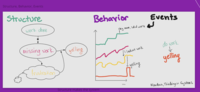
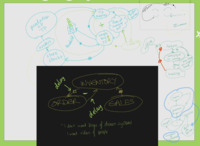
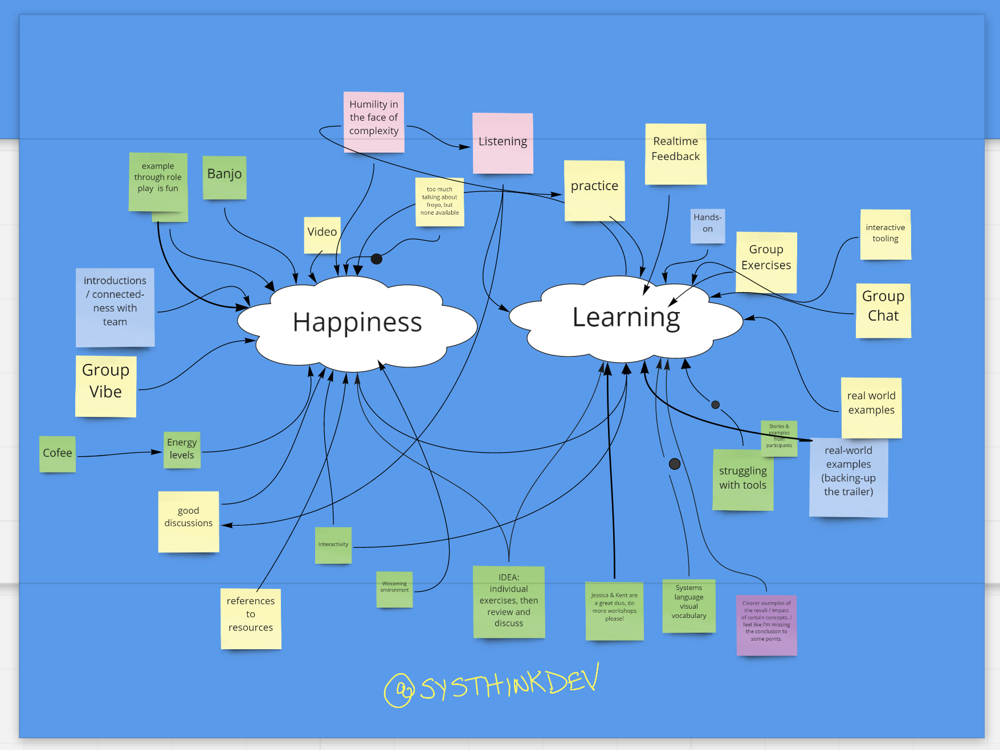

# Invitation to Systems Thinking

Are you frustrated with how illogical the world is and baffled by how smart people and well-written software can do wrong things?

If you long for the days when programs were correct and people believed rightly, well sorry, we can’t help you.

But if you’re ready to find new ways of making sense of the world, and discovering new tools for acting in the world as it is right now, this workshop is for you.

Kent Beck and Jessica Kerr will step through an introduction to systems thinking. With examples from software and life, and concepts like feedback loops and leverage points and propensities, we will step through the basics of seeing and changing systems.

We will resolve paradoxes like “Theseus’s Ship” and “The Chicken and The Egg”, gain insight into distributed systems and symmathesies, and answer questions like, “Why is romantic love so powerful?” and “Why does software get harder to change over time?” and “Why will your enterprise never let you self-organize?”

Come with your questions, leave with new (and maybe even better?) questions.

## Available now

There are sixteen [tickets available at EventBrite](https://www.eventbrite.com/e/invitation-to-systems-thinking-january-2021-tickets-129626617703) for $1450 each.

## Three days in January

Before we start: you'll get an invitation to Slack; say hi and start a discussion.

* Monday, 11 January:
  * Drawing Systems, 9:30-11am Pacific / 12:30-2pm Eastern
  * Drawing Systems Together, 12-1:30pm Pacific / 3-4:30pm Eastern
* Tuesday, Nov 12th
  * Controlling Systems, 9:30-11am Pacific / 12:30-2pm Eastern
  * Growing Systems, 12-1:30pm Pacific / 3-4:30pm Eastern
* Thursday, Nov 12th
  * Changing Systems, 9:30-11am Pacific / 12:30-2pm Eastern
  * Our Own Systems, 12-1:30pm Pacific / 3-4:30pm Eastern

## Who is this for?

Someone who has broken down their system reductively optimized each bit, and reached the limit of usefulness of that view, despaired of any alternatives, reduced to action for action’s sake.

Someone who has heard of systems thinking, but not read the books. Who has time to read all that? Chat with Kent and Jessica instead. Then you’ll be excited about reading the books.

## What you'll learn

How to notice feedback loops.
How to distinguish levels.
How to find leverage points for change.

## What you'll unlearn

Cause comes before effect.
Coordination comes from centralized control.
Things happen because someone intends them to happen.
If something works, we can scale it.
Science is about knowing things.
Certainty is our friend.
Human error is a root cause.
Constraints reduce possibilities.

## Day 1: Drawing systems

Before introductions from everyone, see an example of the kind of system modeling we're talking about. 
Then learn the notation, read a play together, and practice drawing systems.
Notice surprising properties of the systems in our pictures, including nonlinearity and feedback loops.
There is more to "why" than "what made it happen?"

## Day 2: Controlling and growing systems

If we can see a system, how do we make it do what we want? Start through Meadows' ranked system interventions, from 
least to most impactful.
Find surprising challenges, and some nonobvious opportunities.

## Day 3: Changing systems

Let's talk about the most powerful ways to impact systems. Transcend paradigms and consider many different kinds of causality.
Then, the best part: present an example of a system in your life, and help others find new choices in their circumstances.

## Tools

We will use Zoom for video and chat during the session, Miro for collaborative drawing and activities, and Slack for discussions before, between, and after workshop sessions. (Only Slack will force you to create an account.)

## Care package

We'll mail you a sticker and a reference bookmark and some other goodies. If we're lucky, it'll get to you before the workshop starts.

More questions? email contact@jessitron.com
